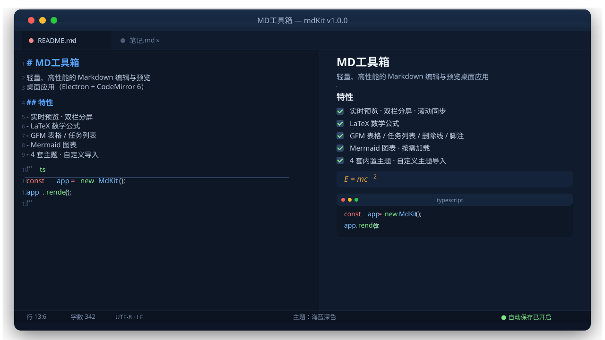

<div align="center">

# MD工具箱（mdKit）

**轻量、高性能的 Markdown 编辑与预览桌面工具箱**

基于 Electron + React + CodeMirror 6 + unified 构建，为开发者、技术写作者与知识管理用户提供「所见即所得」的实时编辑体验。


-orange?style=flat-square)

[📥 下载安装](#-下载安装) ·
[✨ 功能特性](#-功能特性) ·
[🚀 快速开始](#-快速开始) ·
[📚 文档](#-文档) ·
[🤝 贡献指南](#-贡献指南) ·
[📄 许可证](#-许可证)

</div>

---

## 🖼 界面预览

> 深色「海蓝」主题下的双栏分屏编辑 —— 左侧 CodeMirror 编辑器，右侧实时渲染预览。



---

## ✨ 功能特性

### ✍️ 编辑体验
- **CodeMirror 6 内核**：Markdown 语法高亮、行号、自动换行、字体大小可调
- **多标签页**：标签间切换完整保留撤销栈、选区与滚动位置
- **快捷键与菜单命令**：新建 / 打开 / 保存 / 撤销重做等完整命令体系
- **Markdown 快捷命令**：加粗、斜体、标题、链接、代码块等一键插入

### 👁 实时预览
- **实时渲染管线**：`remark-parse → remark-gfm → remark-math → rehype → highlight.js / KaTeX`，编辑与预览延迟 ≤ 300ms
- **GFM 全支持**：表格、任务列表、删除线、脚注
- **LaTeX 数学公式**：KaTeX 渲染，行内 `$...$` 与块级 `$$...$$`
- **代码高亮**：highlight.js，60+ 语言
- **Mermaid 图表**：按需懒加载，不拖慢启动
- **滚动同步与光标同步**：长时间拖动编辑区，预览区滚动位置保持；编辑区光标位置在预览区高亮对应
- **图片内联预览**：本地文件 + 远程 HTTPS，点击可放大（Lightbox）

### 🎨 主题与布局
- **4 套内置主题**：浅色默认 / 纸墨浅色 / 深色默认 / 海蓝深色
- **自定义主题**：编辑区与预览区可独立设置或联动，支持导入自定义主题 JSON（Zod 严格校验）
- **三种视图模式**：分屏 / 纯编辑 / 纯预览，分屏比例可拖拽（双击复位 50%）
- **TOC 目录导航**：自动提取标题生成大纲，点击跳转
- **AI 助手面板**：侧边对话，随时召唤

### 📁 文件管理
- 打开 / 新建 / 保存 / 另存为
- 文件拖拽打开、最近文件列表（最多 10 个）
- **自动保存**（默认 30s，可配置）与**崩溃恢复草稿**

### 📤 导出
- **独立 HTML**：KaTeX 样式与字体全部内嵌，离线可用
- **PDF**：Electron `printToPDF` 原生导出

### 🤖 AI 桥接层
- 兼容 **OpenAI 协议**的对话 API，多模型配置切换
- **对话模式 / 文档编辑模式**双模式
- **Diff 预览**：AI 修改逐条接受 / 拒绝
- **隐私保护**：敏感信息自动脱敏后再发送

### 🔐 安全基线
- `contextIsolation: true` / `nodeIntegration: false` / `sandbox: true`
- 严格 CSP，外链一律交由系统浏览器打开
- 渲染管线 `rehype-sanitize` 消毒，杜绝 XSS

---

## 🧱 技术栈

| 层 | 技术 |
|------|------|
| 桌面框架 | Electron 33 · electron-vite · electron-builder |
| 界面 | React 18 · TypeScript · Zustand |
| 编辑器 | CodeMirror 6（@codemirror/* + @lezer/markdown） |
| 渲染管线 | unified · remark（parse/gfm/math）· rehype（highlight/katex/sanitize/stringify） |
| 渲染器 | KaTeX · highlight.js · Mermaid |
| 校验 / 测试 | Zod · Vitest · Playwright（E2E） |

---

## 📦 下载安装

> 最新版本：**v1.0.0**（2026-07-27）

| 安装包 | 说明 | 体积 |
|--------|------|------|
| `MD工具箱-Setup-1.0.0.exe` | NSIS 安装版，支持自定义安装目录 | ~92 MB |
| `MD工具箱-Portable-1.0.0.exe` | 便携版，即开即用，无需安装 | ~92 MB |

**系统要求**：Windows 10 / 11 x64，无需管理员权限。

> 💡 安装包随 GitHub Release 发布；本地构建方式见下方「构建打包」。

---

## 🚀 快速开始

### 环境要求
- Node.js ≥ 18
- npm ≥ 9

### 安装依赖

```bash
npm install
```

### 开发调试

```bash
npm run dev        # 启动 electron-vite 开发模式（HMR）
```

### 类型检查与规范

```bash
npm run typecheck  # Node + Web 双 tsconfig 类型检查
npm run lint       # ESLint（ts/tsx）
```

### 测试

```bash
npm test           # 单元 / 组件 / 集成测试（139 项）
npm run test:sandbox  # 离线沙盒测试（92 项，纯 Node 无浏览器）
npm run bench      # 性能基准（1MB 文档 / 60 公式 / 200KB+防抖）
npm run e2e        # 端到端测试（真实 Electron，5 项）
```

### 构建打包

```bash
npm run build      # electron-vite 构建（产出 out/）
npm run dist:win   # 构建 Windows 安装版 + 便携版（release/{version}/）
npm run pack:dir   # 仅构建免安装目录（调试打包用）
```

---

## ⌨️ 常用快捷键

| 快捷键 | 功能 |
|--------|------|
| `Ctrl + N` | 新建文档 |
| `Ctrl + O` | 打开文件 |
| `Ctrl + S` / `Ctrl + Shift + S` | 保存 / 另存为 |
| `Ctrl + Z` / `Ctrl + Shift + Z` | 撤销 / 重做 |
| `Ctrl + B` / `Ctrl + I` | 加粗 / 斜体 |
| `Ctrl + E` | 切换分屏模式 |
| `Ctrl + ,` | 打开设置 |

> 完整命令见应用内「帮助 → 快捷键」。

---

## 🗂 项目结构

```
mdKit/
├── src/
│   ├── main/          # Electron 主进程（窗口、IPC、文件、导出、AI 桥接、配置）
│   ├── preload/       # 类型化 preload 桥（contextBridge）
│   ├── renderer/      # 渲染进程
│   │   ├── editor/    # CodeMirror 6 编辑器封装与 Markdown 命令
│   │   ├── preview/   # 渲染管线、滚动/光标同步、Mermaid 懒加载
│   │   ├── theme/     # 主题引擎（4 内置 + 自定义导入）
│   │   ├── ai/        # AI 对话面板、Diff 预览、脱敏
│   │   ├── layout/    # 分屏布局与视图模式
│   │   ├── document/  # 文档状态、自动保存、草稿
│   │   └── components/# 标签栏、状态栏、TOC、设置等 UI 组件
│   └── shared/        # 跨进程契约（IPC 通道、配置 Schema、主题类型）
├── docs/              # 需求、架构、设计、测试、路线图等全套文档
├── tests/             # 单元 / 组件 / 集成 / E2E / 性能 / 沙盒
├── build/             # 打包资源（应用图标）
├── electron-builder.yml
└── package.json
```

---

## ✅ 质量与测试

| 维度 | 结果 |
|------|------|
| 类型检查 | Node + Web 双配置通过 |
| ESLint | 0 errors · 0 warnings |
| 单元 / 组件 / 集成 | **139 / 139 通过** |
| 离线沙盒 | **92 / 92 通过**（纯 Node 环境） |
| 性能基准 | **3 / 3 通过**（1MB 文档 · 60 公式 · 200KB + 防抖） |
| E2E（源码构建） | **5 / 5 通过** |
| E2E（打包产物） | **5 / 5 通过** |
| 离线运行 | 沙盒验证通过，断网可用 |

> 详细报告见 [docs/测试报告.md](docs/测试报告.md) 与 [docs/opencode-验收修复报告.md](docs/opencode-验收修复报告.md)。

---

## 📚 文档

| 文档 | 说明 |
|------|------|
| [需求分析文档](docs/需求分析文档.md) | 功能与非功能性需求、验收标准 |
| [架构决策输入](docs/架构决策输入.md) | 技术选型与架构决策记录 |
| [架构设计文档](docs/架构设计文档.md) | 模块拓扑、接口契约、数据流、部署方案 |
| [详细设计文档](docs/详细设计文档.md) | 数据结构、状态管理、算法流程、错误处理 |
| [测试报告](docs/测试报告.md) | 全量测试结果与命令 |
| [发布说明](docs/RELEASE-v1.0.0.md) | v1.0.0 新特性、修复与已知问题 |
| [项目路线图](docs/项目路线图.md) | 阶段划分与进度总览 |

---

## 🤝 贡献指南

欢迎提交 Issue 与 Pull Request！

1. **Fork** 本仓库并创建新分支：`git checkout -b feat/xxx`
2. **编码**：遵循 [docs/开发规范.md](docs/开发规范.md)
3. **测试**：改动必须附带或更新测试，并保证全量通过
4. **提交**：使用规范化的提交信息（`feat:` / `fix:` / `docs:` / `chore:` …）
5. **PR**：描述改动内容与测试结果

---

## 👥 贡献者

<!-- 贡献者区：不包含任何 AI 助手署名 -->

<a href="https://github.com/jiang585">
  
</a>

**jiuji** — 项目作者、架构与技术负责人，负责整体设计、集成与发布。

<br clear="left"/>

> 本项目在需求分析、架构设计、编码、测试、美化等环节通过多模型协作完成，最终由作者 jiuji 审核、集成并发布。

---

## 📄 许可证

本项目采用 **[MIT 风格开源协议](LICENSE)，商用需授权**：

- ✅ **个人、学习、研究与开源项目**可自由使用、修改与分发
- ⚠️ **商业使用**（销售、嵌入商业产品、企业内部商用、付费服务等）需获得版权方**书面授权**
- 商用授权请联系：**jiuji** <q2795272066@gmail.com>

> 版权 © 2026 jiuji

---

<div align="center">

**Made with ❤️ by jiuji** · [回到顶部](#md工具箱mdkit)

</div>
